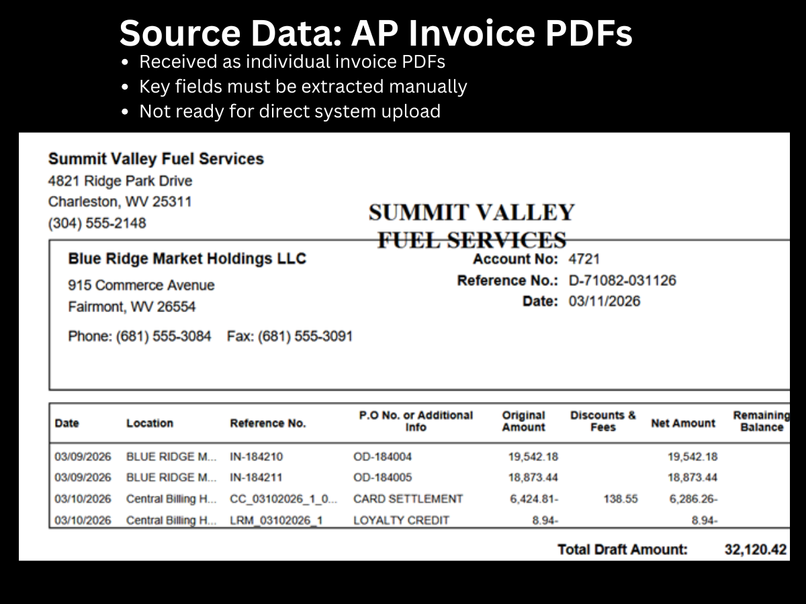
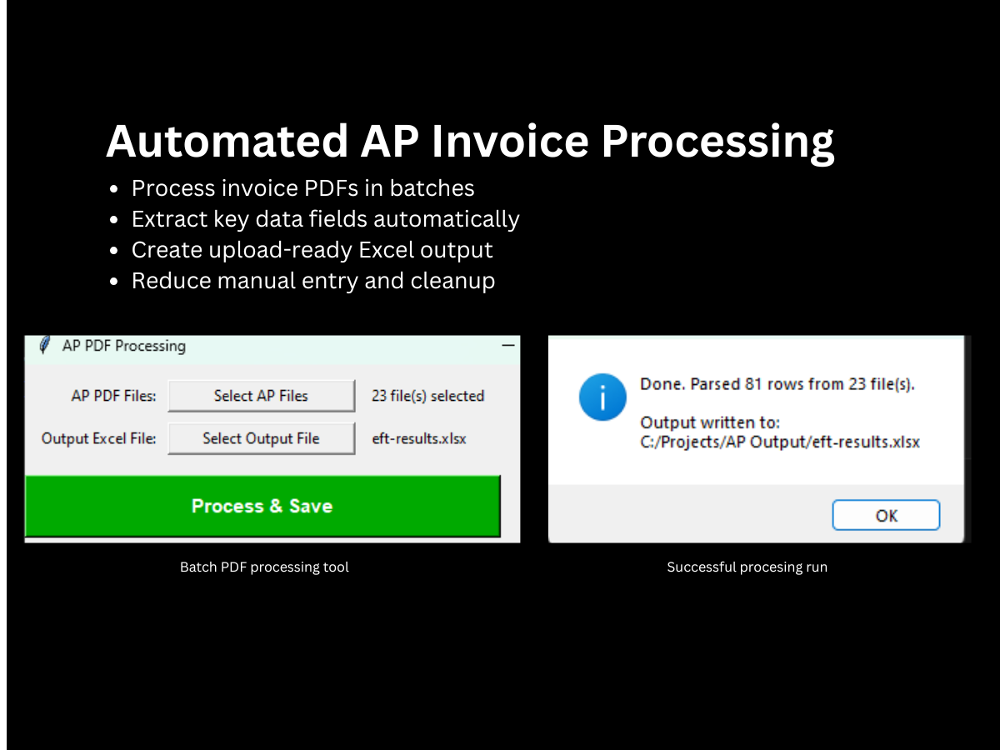
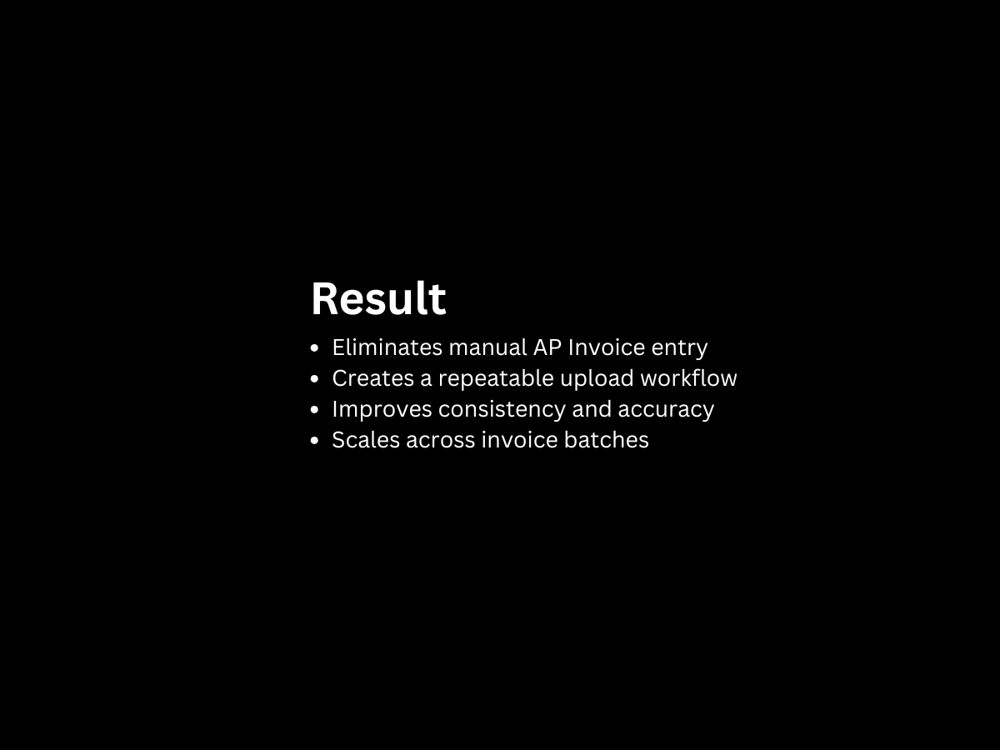

# Automated Invoice Processing

## Overview

This project documents an automated accounts payable workflow that converts vendor PDF invoices into upload-ready Excel files for an accounting system.

The workflow was designed to reduce manual invoice entry, standardize vendor-specific invoice data, and create a repeatable process for preparing invoice and clearing files.

---

# Business Impact

This automation transformed a repetitive accounts payable workflow into a standardized, repeatable process.

### Impact

* Reduced manual invoice entry by automatically extracting invoice data from PDF documents.
* Standardized vendor invoice information before accounting system import.
* Produced consistent upload-ready Excel files for downstream accounting processes.
* Reduced opportunities for manual data entry errors.
* Improved processing speed for recurring vendor invoices.
* Created a repeatable workflow that could be executed consistently regardless of the user.
* Reduced time spent preparing invoice and clearing files for import.

Although exact processing times varied depending on invoice volume, the automation significantly reduced manual effort while improving consistency across the accounts payable process.

---

## Case Study Note

This repository is presented as an anonymized portfolio case study. The original source code is not included because it was created inside a prior employer’s environment and contained proprietary business logic, file paths, vendor information, and accounting system details.

The purpose of this repository is to document the business problem, workflow design, automation approach, and measurable value of the project while respecting data privacy and employer confidentiality.

## Business Problem

A recurring accounts payable process required manual review of vendor PDF invoices, manual data entry, spreadsheet formatting, and follow-up matching/clearing work.

This created several problems:

* Repetitive manual entry
* Increased risk of data entry errors
* Inconsistent spreadsheet formatting
* Time-consuming preparation of upload-ready files
* Extra work required to match and clear processed invoices

## Solution

I built an automated workflow that extracts invoice information from PDF files, transforms the data into a structured format, and generates Excel files ready for upload into the accounting system.

A supporting automation also generated matching and clearing files, helping complete the full AP processing cycle.

## Workflow

Vendor PDF

↓

Extract Invoice Data

↓

Standardize Fields

↓

Generate Upload Workbook

↓

Generate Clearing File

↓

Accounting System Import

---

## Project Gallery

### 1. Source Invoice PDF

Example of the source PDF invoice format used as the starting point for the automation. The workflow was designed to extract key invoice details from this type of vendor document.

### 2. Extracted Invoice Data

Structured invoice data after extraction from the PDF source. This step converts unstructured invoice information into a format that can be cleaned, reviewed, and transformed.

### 3. Cleaned Processing File

Intermediate processing file showing standardized fields, cleaned values, and prepared invoice data before final upload formatting.

### 4. Upload-Ready Excel Output

Final Excel output formatted for accounting system upload. The automation reduces manual entry by producing a file that follows the required upload structure.

### 5. Matching and Clearing Support File

Supporting file used to help match, clear, or reconcile processed invoice activity after upload.

---

## Technologies Used

- Python
- Microsoft Excel
- PDF Data Extraction
- Data Transformation
- Workflow Automation
- Financial Reporting

---

## Skills Demonstrated

* Python automation
* PDF data extraction
* Excel file generation
* Accounts payable workflow design
* Data cleaning and transformation
* Financial operations automation
* Process improvement
* Accounting system upload preparation
* Error reduction through repeatable workflows

---

## Key Design Decisions & Lessons Learned

Developing this project reinforced several important principles of finance automation.

### Separate Data Extraction from Data Transformation

The workflow was intentionally divided into distinct stages. First, invoice data was extracted from PDF documents. Then the extracted data was cleaned, standardized, and transformed into the required accounting upload format. Separating these responsibilities made the workflow easier to maintain and extend.

### Standardize Before Import

Rather than generating upload files directly from extracted invoice data, the process standardized every field before creating the final Excel output. This reduced inconsistencies and simplified downstream processing.

### Design Around Business Processes

The goal was never simply to extract text from PDFs. The real objective was to automate an accounts payable workflow. Every design decision focused on reducing repetitive accounting work rather than demonstrating technical features.

### Build Repeatable Processes

Recurring financial processes benefit from consistency more than speed alone. Creating standardized outputs helped ensure reliable processing each time the automation was executed.

### Protect Data Quality

Financial data requires accuracy. The workflow emphasized predictable formatting and structured output so accounting staff could review and import invoice information with confidence.

---

### What I Would Improve Today

If I were rebuilding this project today, I would:

* Add OCR support for scanned invoices.
* Support multiple vendor invoice layouts through configurable templates.
* Store vendor-specific parsing rules in configuration files rather than code.
* Add automated exception reporting for invoices that could not be parsed.
* Generate detailed processing logs and audit reports.
* Integrate directly with ERP or accounting system APIs where available instead of producing intermediate Excel files.
* Incorporate AI-assisted document understanding to improve handling of previously unseen invoice formats.

---

## Privacy Note

This repository is an anonymized portfolio case study. Vendor names, client/company details, accounting system information, source files, and proprietary data have been removed or replaced.

## Project Status

Portfolio case study. Source code is not included due to employer confidentiality and proprietary system details. Screenshots and documentation are provided to demonstrate the workflow, business problem, automation design, and finance process improvement.

## Professional Context

This project demonstrates my approach to solving business problems through automation. Rather than automating a single task, the solution transformed a repetitive accounts payable workflow into a structured, repeatable process that reduced manual effort while improving consistency and data quality.

---

## Lessons Learned

While building this project I improved my understanding of:

- PDF parsing challenges
- Data validation
- Accounting workflow automation
- Exception handling
- Creating reusable automation for finance teams
