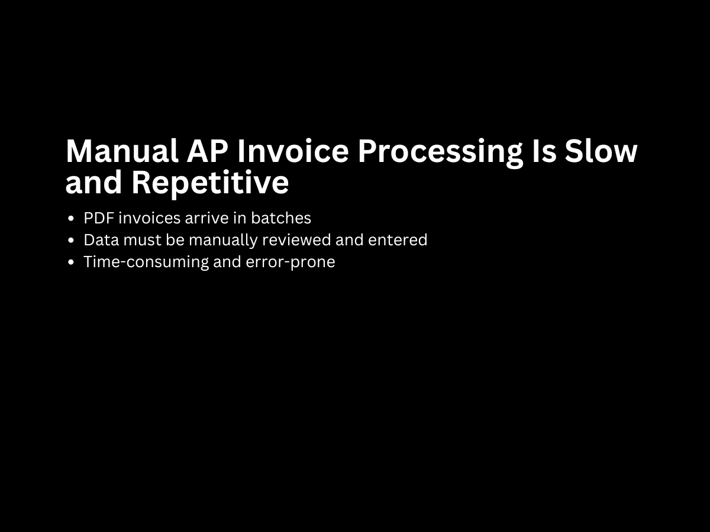
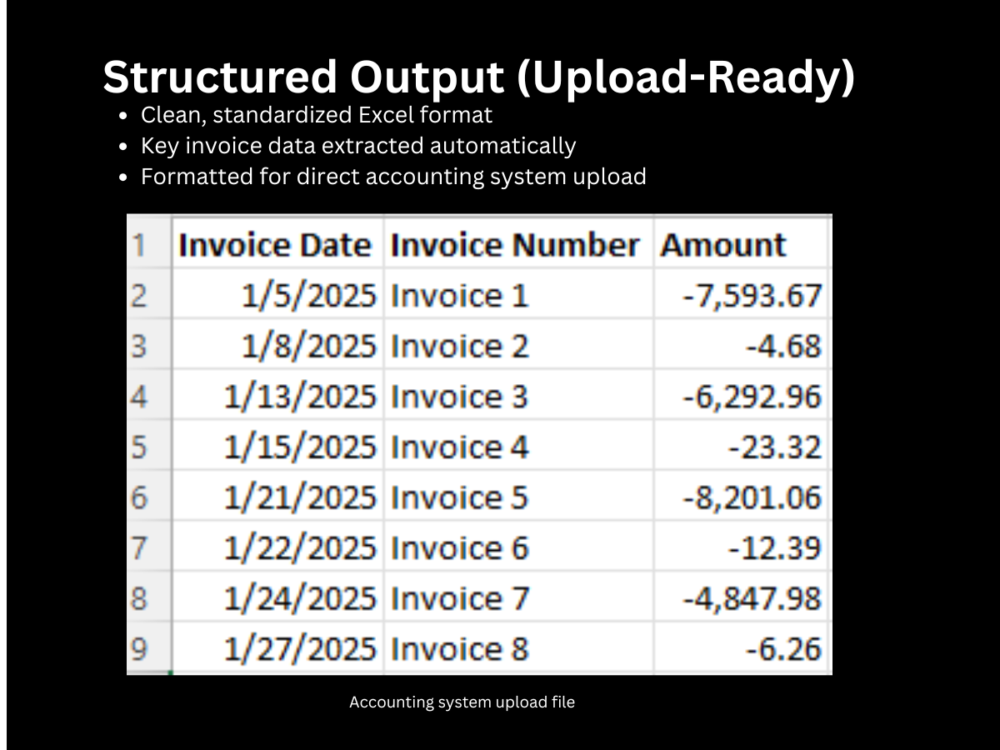

# Automated Invoice Processing

## Overview

This project documents an automated accounts payable workflow that converts vendor PDF invoices into upload-ready Excel files for an accounting system.

The workflow was designed to reduce manual invoice entry, standardize vendor-specific invoice data, and create a repeatable process for preparing invoice and clearing files.

## Case Study Note

This repository is presented as an anonymized portfolio case study. The original source code is not included because it was created inside a prior employer’s environment and contained proprietary business logic, file paths, vendor information, and accounting system details.

The purpose of this repository is to document the business problem, workflow design, automation approach, and measurable value of the project while respecting data privacy and employer confidentiality.

## Business Problem

A recurring accounts payable process required manual review of vendor PDF invoices, manual data entry, spreadsheet formatting, and follow-up matching/clearing work.

This created several problems:

* Repetitive manual entry
* Increased risk of data entry errors
* Inconsistent spreadsheet formatting
* Time-consuming preparation of upload-ready files
* Extra work required to match and clear processed invoices

## Solution

I built an automated workflow that extracts invoice information from PDF files, transforms the data into a structured format, and generates Excel files ready for upload into the accounting system.

A supporting automation also generated matching and clearing files, helping complete the full AP processing cycle.

## Workflow

1. Vendor PDF invoices are collected.
2. The automation reads and extracts invoice data.
3. Extracted data is cleaned and standardized.
4. Required accounting upload fields are generated.
5. Upload-ready Excel files are produced.
6. Supporting clearing/matching files are created.
7. The accounting team reviews exceptions and completes the upload process.

## Skills Demonstrated

* Python automation
* PDF data extraction
* Excel file generation
* Accounts payable workflow design
* Data cleaning and transformation
* Financial operations automation
* Process improvement
* Accounting system upload preparation
* Error reduction through repeatable workflows

## Screenshots

### 1. Source Invoice PDF

Example of the source PDF invoice format used as the starting point for the automation. The workflow was designed to extract key invoice details from this type of vendor document.

### 2. Extracted Invoice Data

Structured invoice data after extraction from the PDF source. This step converts unstructured invoice information into a format that can be cleaned, reviewed, and transformed.

### 3. Cleaned Processing File

Intermediate processing file showing standardized fields, cleaned values, and prepared invoice data before final upload formatting.

### 4. Upload-Ready Excel Output

Final Excel output formatted for accounting system upload. The automation reduces manual entry by producing a file that follows the required upload structure.

### 5. Matching and Clearing Support File

Supporting file used to help match, clear, or reconcile processed invoice activity after upload.

## Business Impact

This workflow helped convert a manual AP process into a repeatable automation.

Key benefits included:

* Reduced manual invoice entry
* Improved consistency of upload files
* Lower risk of data entry errors
* Faster invoice processing
* Better support for matching and clearing activity
* A reusable process for recurring vendor invoices

## Privacy Note

This repository is an anonymized portfolio case study. Vendor names, client/company details, accounting system information, source files, and proprietary data have been removed or replaced.

## Project Status

Portfolio case study. Source code is not included due to employer confidentiality and proprietary system details. Screenshots and documentation are provided to demonstrate the workflow, business problem, automation design, and finance process improvement.

## Professional Context

This project reflects my experience combining accounting operations with automation. It demonstrates how Python and Excel-based workflows can improve finance processes, reduce repetitive work, and create cleaner data for accounting teams.

## Lessons Learned

While building this project I improved my understanding of:

- PDF parsing challenges
- Data validation
- Accounting workflow automation
- Exception handling
- Creating reusable automation for finance teams
